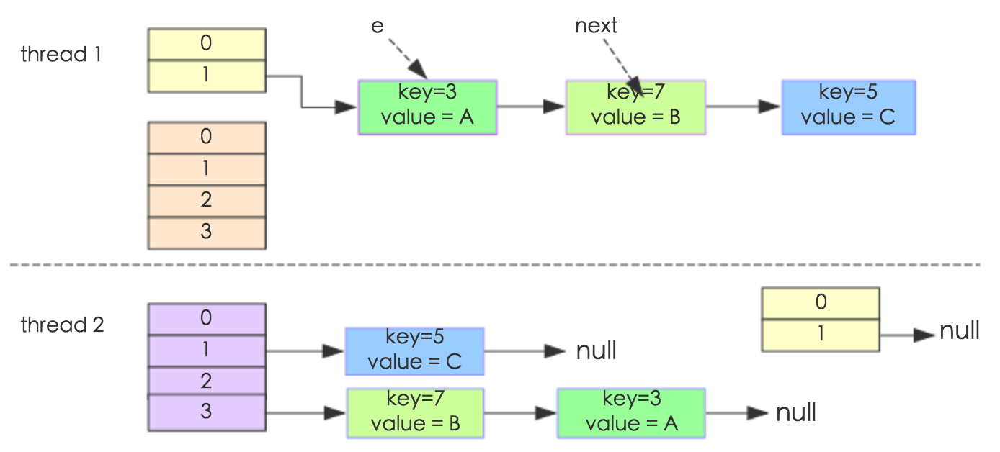
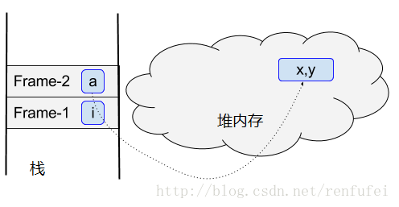
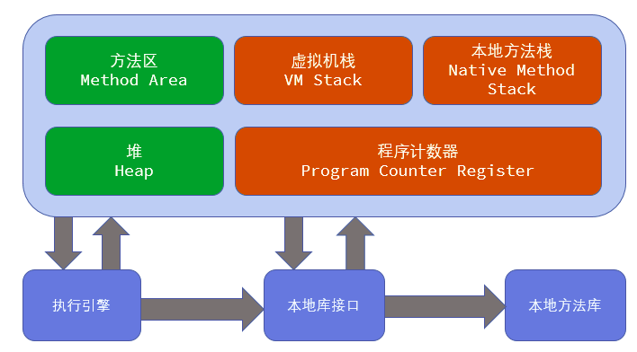
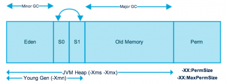
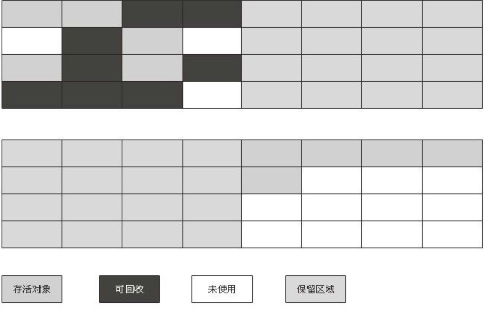

# java基础
## 1. List和Set的区别

List和Set都继承了Collection
Set是最简单的一种集合, 集合中的对象不按特定的方式排序, 并且没有重复的对象.
List的特征是其元素以线性方式存储, 集合中可以存放重复对象.

## 2. HashSet是如何保证不重复的?

在调用HashSet中的add方法时, 实际是在调用 HashMap的put方法, 像hashmap中添加key.
HashMap在put一个key时会判断将要放进去的key的hash值和对象地址或者内容是否一样,
则判断出来要添加的Key与HashMap中的Key重复, 把Value的值给替换成最新的.
当然HashSet中的Value是一个固定值PRESENT. 所以修改不修改无所谓.

## 3. HashMap是线程安全的吗, 为什么不是线程安全的(最好画图说明多线程环境下不安全)

不是线程安全的.


① put的时候导致的多线程数据不一致。
这个问题比较好想象，比如有两个线程A和B，首先A希望插入一个key-value对到HashMap中，首先计算记录所要
落到的桶的索引坐标，然后获取到该桶里面的链表头结点，此时线程A的时间片用完了，而此时线程B被调度得以
执行，和线程A一样执行，只不过线程B成功将记录插到了桶里面，假设线程A插入的记录计算出来的桶索引和线程
B要插入的记录计算出来的桶索引是一样的，那么当线程B成功插入之后，线程A再次被调度运行时，它依然持有过
期的链表头但是它对此一无所知，以至于它认为它应该这样做，如此一来就覆盖了线程B插入的记录，这样线程B插
入的记录就凭空消失了，造成了数据不一致的行为。

② 另外一个比较明显的线程不安全的问题是HashMap的get操作可能因为resize而引起死循环（cpu100%），具体分析如下：
下面的代码是resize的核心内容：

```java
void transfer(Entry[] newTable, boolean rehash) {
    int newCapacity = newTable.length;
    for (Entry<K,V> e : table) {
        while(null != e) {
            Entry<K,V> next = e.next;
            if (rehash) {
                e.hash = null == e.key ? 0 : hash(e.key);
            }
            int i = indexFor(e.hash, newCapacity);
            e.next = newTable[i];
            newTable[i] = e;
            e = next;
        }
    }
}
```
这个方法的功能是将原来的记录重新计算在新桶的位置，然后迁移过去。



我们假设有两个线程同时需要执行resize操作，我们原来的桶数量为2，记录数为3，需要resize桶到4，原来的记录分别为：
[3,A],[7,B],[5,C]，在原来的map里面，我们发现这三个entry都落到了第二个桶里面。
假设线程thread1执行到了transfer方法的Entry next = e.next这一句，然后时间片用完了，此时的e = [3,A], next = [7,B]。
线程thread2被调度执行并且顺利完成了resize操作，需要注意的是，此时的[7,B]的next为[3,A]。此时线程thread1重新被调度运行，
此时的thread1持有的引用是已经被thread2 resize之后的结果。线程thread1首先将[3,A]迁移到新的数组上，然后再处理[7,B]，
而[7,B]被链接到了[3,A]的后面，处理完[7,B]之后，就需要处理[7,B]的next了啊，而通过thread2的resize之后，[7,B]的next
变为了[3,A]，此时，[3,A]和[7,B]形成了环形链表，在get的时候，如果get的key的桶索引和[3,A]和[7,B]一样，那么就会陷入死循
环。

## 4. HashMap的扩容过程

首先要了解HashMap的扩容过程, 我们就得了解一些HashMap中的变量：
① Node<K,V>：链表节点, 包含了key、value、hash、next指针四个元素
② table：Node<K,V>类型的数组, 里面的元素是链表, 用于存放HashMap元素的实体
③ size：记录了放入HashMap的元素个数
④ loadFactor：负载因子
⑤ threshold：阈值, 决定了HashMap何时扩容, 以及扩容后的大小, 一般等于table大小乘以loadFactor.
值得注意的是, 当我们自定义HashMap初始容量大小时, 构造函数并非直接把我们定义的数值当做HashMap容量大小,
而是把该数值当做参数调用方法tableSizeFor, 然后把返回值作为HashMap的初始容量大小：
```java
/**
 *Returns a power of two size for the givenk target capacity.
 */
static final int tableSizeFor(int cap) {
    int n = cap - 1;
    n |= n >>> 1;
    n |= n >>> 2;
    n |= n >>> 4;
    n |= n >>> 8;
    n |= n >>> 16;
    return (n < 0) ? 1 : (n >= MAXIMUM_CAPACITY) ? MAXIMUM_CAPACITY : n + 1;
}
```
该方法会返回一个大于等于当前参数的2的倍数, 因此HashMap中的table数组的容量大小总是2的倍数.
HashMap使用的是懒加载, 构造完HashMap对象后, 只要不进行put 方法插入元素之前, HashMap并不会去初始化或者扩容table：
```java
public V put(K key, V value) {
    return putVal(hash(key), key, value, false, true);
}
final V putVal(int hash, K key, V value, boolean onlyIfAbsent, boolean evict) {
    Node<K,V>[] tab; Node<K,V> p; int n, i;
    if ((tab = table) == null || (n = tab.length) == 0)
        n = (tab = resize()).length;
    if ((p = tab[i = (n - 1) & hash]) == null)
        tab[i] = newNode(hash, key, value, null);
    else {
        ...
    }
    ++modCount;
    if (++size > threshold)
        resize();
    afterNodeInsertion(evict);
    return null;
}
```
在putVal方法第8、9行我们可以看到, 当首次调用put方法时, HashMap会发现table为空然后调用resize方法进行初始化
在putVal方法第16、17行我们可以看到, 当添加完元素后, 如果HashMap发现size（元素总数）大于threshold（阈值）, 则会调用resize
方法进行扩容在这里值得注意的是, 在putVal方法第10行我们可以看到, 插入元素的hash值是一个32位的int值, 而实际当前元素插入table
的索引的值为 ：
```java
(table.size - 1) & hash
例如: 01111 & hash 等于hash值的后4位
```
又由于table的大小一直是2的倍数, 2的N次方, 因此当前元素插入table的索引的值为其hash值的后N位组成的值

## 5. HashMap 1.7 与 1.8 的区别, 说明1.8做了哪些优化, 如何优化的?

在JDK7中, HashMap 的结构都是这么简单, 基于一个数组以及多个链表的实现,
hash值冲突的时候, 就将对应节点以链表的形式存储. 这样子 HashMap 性能上
就抱有一定的疑问, 如果说成百上千个节点在 hash 时发生碰撞, 存储于一个链
表中, 那么如果查找其中一个节点, 那就不可避免的花费O(N)的查找时间, 这将是多么大的性能损失. 这个JDK8中得到了解决. 在最坏的情
况下, 查找一个节点的时间复杂度为 O(N), 而红黑树一直是 O(logN), 这样会提高 HashMap 的效率. JDK7中 HashMap 采用位桶+链表的
方式, 即我们常说的散列链表的方式, JDK8中采用的是位桶+链表/红黑树的方式, 也是非线程安全的. 当某个位桶的链表长度达到某个阈值的
时候, 这个链表就将转换成红黑树.
JDK8中, 当某个 hash 值的节点数不小于8时, 将不再以链表的形式存储, 会被调整成一颗红黑树.

## 6. final finally finalize

final 用于修饰类, 成员变量和成员方法. final 修饰的类, 不能被继承, 其中所有的方法都不能被重写, 所以不能同时用 abstract 和 
final 修饰类. final 修饰的方法不能被重写, 但是子类可以用父类中 final 修饰的方法. final 修饰的成员变量是不可变的, 如果成员
变量是基本数据类型, 初始化后成员变量的值不能被改变, 如果成员变量是引用类型, 那么它只能指向初始化时指向的那个对象, 不能再指向
别的对象, 但是对象当中的内容是允许改变的.

finally 通常和 try catch 搭配使用, 保证不管有没有发生异常, 资源都能够被释放

finalize是 Object 类中的一个方法, 子类可以重写 finalize()方法实现对资源的回收. 垃圾回收只负责回收内存, 并不负责资源的回收, 
资源回收是由程序员完成. java虚拟机在垃圾回收之前会先调用垃圾对象的 finalize 方法用于使对象释放资源, 自后才进行垃圾回收, 这个
方法一般不会显示的调用, 在垃圾回收时垃圾回收器会主动调用.

## 7. 强引用, 软引用, 弱引用, 虚引用

强引用: 只要引用存在, 垃圾回收器永远不会回收
Object obj = new Object(); // 可直接通过 obj 取得对应的对象如 obj.equals(new Object());
而这样 obj 对象是对后面 new Object的一个强引用, 只有当 obj 这个引用被释放之后, 对象才会被释放掉, 这也是我们经常使用的编码形式.

软引用: 非必须引用, 内存溢出之前进行回收, 可以通过以下代码实现
Object obj = new Object();
SoftReference<Object> sf = new SoftReference<Object>(obj);
obj = null;
sf.get();//有时候会返回null
这时候sf是对obj的一个软引用, 通过sf.get()方法可以取到这个对象, 当然, 当这个对象被标记为需要回收的对象时, 则返回null；
软引用主要用户实现类似缓存的功能, 在内存足够的情况下直接通过软引用取值, 无需从繁忙的真实来源查询数据, 提升速度；当内存不足时, 
自动删除这部分缓存数据, 从真正的来源查询这些数据。

弱引用：
第二次垃圾回收时回收, 可以通过如下代码实现
Object obj = new Object();
WeakReference<Object> wf = new WeakReference<Object>(obj);
obj = null;
wf.get();//有时候会返回null
wf.isEnQueued();//返回是否被垃圾回收器标记为即将回收的垃圾
弱引用是在第二次垃圾回收时回收, 短时间内通过弱引用取对应的数据, 可以取到, 当执行过第二次垃圾回收时, 将返回null。
弱引用主要用于监控对象是否已经被垃圾回收器标记为即将回收的垃圾, 可以通过弱引用的isEnQueued方法返回对象是否被垃圾回收器标记。

虚引用：
垃圾回收时回收, 无法通过引用取到对象值, 可以通过如下代码实现
```java
Object obj = new Object();
PhantomReference<Object> pf = new PhantomReference<Object>(obj);
obj=null;
pf.get();//永远返回null
pf.isEnQueued();//返回是否从内存中已经删除
```
虚引用是每次垃圾回收的时候都会被回收, 通过虚引用的get方法永远获取到的数据为null, 因此也被成为幽灵引用。
虚引用主要用于检测对象是否已经从内存中删除。

## 8. java反射


## 9. Arrays.sort的实现原理和Collection实现原理

Arrays.sort
数组长度 N < 47 时, 使用插入排序算法
数组长度 47 < N < 286 时, 使用双轴快速排序算法
数组长度 N >= 286 时,连续性好用归并排序, 连续性不好用双轴快速排序算法


Collections.sort
先判断useLegacyMergeSort是否为true, 如果为true就会使用传统归并排序, 如果不为true就会使用叫Timsort算法
Timsort的核心过程
Timsort算法为了减少对升序部分的回溯和对降序部分的性能倒退, 将输入按其升序和降序特点进行了分区。排序的输入的单位不是一个个单独的数字，
而是一个个的块-分区。其中每一个分区叫一个run。针对这些 run 序列，每次拿一个 run 出来按规则进行合并。每次合并会将两个 run合并成一个
run。合并的结果保存到栈中。合并直到消耗掉所有的 run，这时将栈上剩余的 run合并到只剩一个 run 为止。这时这个仅剩的 run 便是排好序的结果。
综上述过程，Timsort算法的过程包括
（0）如何数组长度小于某个值, 直接用二分插入排序算法.
（1）找到各个run, 并入栈.
（2）按规则合并run.


## 10. LinkedHashMap的应用


## 11. cloneable接口实现原理


## 12. 异常分类以及处理机制


## 13. wait和sleep的区别

#### sleep()
sleep()使当前线程进入停滞状态（阻塞当前线程）, 让出CUP的使用、目的是不让当前线程独自霸占该进程所获的CPU资源,
以留一定时间给其他线程执行的机会;
sleep()是Thread类的Static(静态)的方法；因此他不能改变对象的锁状态, 所以当在一个Synchronized块中调用Sleep()方法时,
线程虽然休眠了, 但是对象的锁并木有被释放, 其他线程无法访问这个对象（即使睡着也持有对象锁）。
在sleep()休眠时间期满后, 该线程不一定会立即执行, 这是因为其它线程可能正在运行而且没有被调度为放弃执行, 除非此线程
具有更高的优先级。
#### wait()
wait()方法是Object类里的方法；当一个线程执行到wait()方法时，它就进入到一个和该对象相关的等待池中，同时失去（释放）
了对象的机锁（暂时失去机锁，wait(long timeout)超时时间到后还需要返还对象锁）；其他线程可以访问；
wait()使用notify或者notifyAlll或者指定睡眠时间来唤醒当前等待机锁k池中的线程。
wiat()必须放在synchronized block中，否则会在program runtime时扔出"java.lang.IllegalMonitorStateException"异常。

所以sleep()和wait()方法的最大区别是：
　　　　sleep()睡眠时，保持对象锁，仍然占有该锁；
　　　　而wait()睡眠时，释放对象锁。

## 14. 数组在内存中如何分配

Java中数组存储两类事物: 基本数据类型或者引用(对象指针).
当一个对象通过new 创建, 那么将在堆内存中分配一段空间, 并返回其引用(指针).
对于数组也是同样的方式.
Java中的数组,也是对象(继承Object),因此数组所在的区域和对象是一样的.

```java
class A {
    int x;
    int y;
}
public void m1() {
    int i = 0;
    m2();
}
public void m2() {
    A a = new A();
}
```

上面的代码片段中,让我们执行 m1()方法看看发生了什么:
    ① 当 m1 被调用时,一个新的栈帧(Frame-1)被压入JVM栈中,当然,相关的局部变量也在 Frame-1中创建, 比如 i;
    ② 然后 m1调用m2,,又有一个新的栈帧(Frame-2)被压入到JVM栈中;
    ③ m2方法在堆内存中创建了A类的一个对象,此对象的引用保存在 Frame-2的局部变量 a 中. 此时,堆内存和栈内存
    看起来如下所示:
    

# java并发
## 1. synchronized的实现原理以及锁优化


## 2. volatile的实现原理是


## 3. java信号灯


## 4. synchronized在静态方法和普通方法的区别


## 5. 怎么实现所有线程在等待某个时间的发生才会去执行?


## 6. CAS? CAS有什么缺陷? 如何解决?

Compare and Swap. 比较并交换
CAS存在一个逻辑漏洞: 如果一个变量V初次读取的时候是A值, 并且在准备赋值的时候检查到它仍然为A值, 那我们就能说它的值
没有被其他线程改变过了吗? 如果在这段期间它的值曾经被改成了B, 后来又被改回A, 那CAS操作就会误认为它从来没有被改变过.
这个漏洞被称为CAS操作的"ABA"的问题.
java.util.concurrent包为了解决这个问题, 提供了一个带有标记的原子引用类 "AtomicStampedReference", 它可以通过控制
变量值的版本来保证CAS的正确性. 或者使用 传统的互斥同步.

## 7. synchronized和lock有什么区别?


## 8. HashTable是怎么加锁的?


## 9. HashMap的并发问题?


## 10. ConcurrentHashMap介绍? 1.8中为什么要用红黑树?

红黑树:
降低查找同hash值的对象时的时间复杂度, 链表 => 链表/红黑树.
O(N) -> O(lgN)

## 11. AQS


## 12. 如何检测死锁? 怎么预防死锁?


## 13. java内存模型


## 14. 如何保证多线程下i++结果正确


## 15. 线程池的种类, 区别和使用场景


## 16. 分析线程池的实现原理和线程的调度过程?


## 17. 线程池如何调优, 最大数目如何确认?

创建线程及后续的销毁过程的代价是非常昂贵的, 因为jvm和操作系统都需要分配资源.
如果手动创建线程, 如果不进行适当管理, 很可能引发灾难性后果.每个线程都需要一定的栈内存空间. 在最近
的64位jvm中, 默认的栈大小是1024KB, 持续的创建线程会占用大量的线程栈空间, 每个线程代码执行过程中创
建对象, 还可能在堆上创建对象, 这样的情况恶化下去, 将会超出堆内存, 并产生大量的垃圾回收操作, 最终引
发 内存溢出(OutOfMemoryErrors)线程栈大小引发的内存问题, 可以通过-Xss开关来调整栈大小, 缩小线程栈
大小后, 可以减少每个线程的开销, 但是可能会引发栈溢出(StackOverFlowErrors). 对于一般的应用程序而
言, 默认的1024KB过于富裕, 调小为256KB或者512KB可能更为合适. java允许的最小值是160KB. 为了避免持
续创建新线程, 可以通过使用简单的线程池来限定线程池的上限. 线程池会管理所有的线程, 如果线程数还没有
达到上限, 线程池会创建线程到上限, 且尽可能复用空闲的线程.

### 设置最大线程数
对于给定硬件上的给定负载，最大线程数设置为多少最好呢？这个问题回答起来并不简单：它取决于负载特
性以及底层硬件。特别是，最优线程数还与每个任务阻塞的频率有关。

假设JVM有4个CPU可用，很明显最大线程数至少要设置为4。的确，除了处理这些任务，JVM还有些线程要做
其他的事，但是它们几乎从来不会占用一个完整的CPU，至于这个数值是否要大于4，则需要进行大量充分的测试。

有以下两点需要注意：

一旦服务器成为瓶颈，向服务器增加负载时非常有害的；

对于CPU密集型或IO密集型的机器增加线程数实际会降低整体的吞吐量；

### 设置最小线程数
一旦确定了线程池的最大线程数，就该确定所需的最小线程数了。大部分情况下，开发者会直截了当的将他们
设置成同一个值。

将最小线程数设置为其他某个值（比如1），出发点是为了防止系统创建太多线程，以节省系统资源。指定一个最
小线程数的负面影响相当小。如果第一次就有很多任务要执行，会有负面影响：这是线程池需要创建一个新线程。
创建线程对性能不利，这也是为什么起初需要线程池的原因。

一般而言，对于线程数为最小值的线程池，一个新线程一旦创建出来，至少应该保留几分钟，以处理任何负载飙升。
空闲时间应该以分钟计，而且至少在10分钟到30分钟之间，这样可以防止频繁创建线程。

### 线程池任务大小
等待线程池来执行的任务会被保存到某个队列或列表中；当池中有线程可以执行任务时，就从队列中拉出一个。这
会导致不均衡：队列中任务的数量可能变得非常大。如果队列太大，其中的任务就必须等待很长时间，直到前面的
任务执行完毕。

对于任务队列，线程池通常会限制其大小。但是这个值应该如何调优，并没有一个通用的规则。若要确定哪个值能
带来我们需要的性能，测量我们的真实应用是唯一的途径。不管是哪种情况，如果达到了队列限制，再添加任务就
会失败。ThreadPoolExecutor有一个rejectedExecution方法，用于处理这种情况，默认会抛出RejectedExecutionExecption。
应用服务器会向用户返回某个错误：或者是HTTP状态码500，或者是Web服务器捕获异常错误，并向用户给出合理的解释
消息—其中后者是最理想的。

### 设置ThreadPoolExecutor的大小
线程池的一般行为是这样的：创建时准备最小数目的线程，如果来了一个任务，而此时所有的线程都在忙碌，则启动
一个新线程（一直到达到最大线程数），任务就会立即执行。否则，任务被加入到等待队列，如果队列中已经无法加
入新任务，则拒接之。

根据所选任务队列的类型，ThreadPoolExecutor会决定何时会启动一个新线程。有以下三种可能：

#### SynchronousQueue
如果ThreadPoolExecutor搭配的是SynchronousQueue，则线程池的行为和我们预期的一样，它会考虑线程数：如果所
有的线程都在忙碌，而且池中的线程数尚未达到最大，则会为新任务启动一个新线程。然而这个队列没办法保存等待
的任务：如果来了一个任务，创建的线程数已经达到最大值，而且所有的线程都在忙碌，则新的任务都会被拒绝，所
以如果是管理少量的任务，这是个不错的选择，对于其他的情况就不适合了。

#### 无界队列
如果ThreadPoolExecutor搭配的是无界队列，如LinkedBlockingQueue，则不会拒绝任何任务（因为队列大小没有限制）。
这种情况下，ThreadPoolExecutor最多仅会按照最小线程数创建线程，也就是说最大线程池大小被忽略了。如果最大线
程数和最小线程数相同，则这种选择和配置了固定线程数的传统线程池运行机制最为接近。

#### 有界队列
搭配了有界队列，如ArrayBlockingQueue的ThreadPoolExecutor会采用一个非常负责的算法。比如假定线程池的最小线
程数为4，最大为8所用的ArrayBlockingQueue最大为10。随着任务到达并被放到队列中，线程池中最多运行4个线程
（即最小线程数）。即使队列完全填满，也就是说有10个处于等待状态的任务，ThreadPoolExecutor也只会利用4个线程。

如果队列已满，而又有新任务进来，此时才会启动一个新线程，这里不会因为队列已满而拒接该任务，相反会启动一个
新线程。新线程会运行队列中的第一个任务，为新来的任务腾出空间。

这个算法背后的理念是：该池大部分时间仅使用核心线程（4个），即使有适量的任务在队列中等待运行。这时线程池
就可以用作节流阀。如果挤压的请求变得非常多，这时该池就会尝试运行更多的线程来清理；这时第二个节流阀—最大
线程数就起作用了。


## 18. ThreadLocal原理, 用的时候需要注意什么?

每一个线程的Thread对象都有一个ThreadLocalMap对象, 这个对象存储了一组以ThreadLocal.ThreadLocalHashCode为键, 以
本地线程变量为值的 K-V 值对, ThreadLocal对象就是当前线程的 ThreadLocalMap的访问入口, 每一个ThreadLocal对象都包含
一个独一无二的threadLocalHashCode值, 使用这个值就可以在线程 K-V 值中找回对应的本地线程变量.

### 注意事项:
① 初始化时, 使用initValue方法.
② 每一个线程都只是使用ThreadLocal标注变量的副本进行计算, 每一个线程的ThreadLocal变量值都是独立的, 不被其他线程影响.

## 19. CountDownLatch和CyclicBarrier的用法, 以及相互之间的差别?


## 20. LockSupport工具


## 21. Condition接口及其实现原理


## 22. Fork/Join框架的理解


## 23. 分段锁的原理, 锁力度减小的思考


## 24. 八种阻塞队列以及各个阻塞队列的特性

#### ArrayBlockingQueue: 一个由数组结构组成的有界阻塞队列
用数组实现的有界阻塞队列。此队列按照先进先出（FIFO）的原则对元素进行排序。默认情况下不保证访问者公平的访问队列，
所谓公平访问队列是指阻塞的所有生产者线程或消费者线程，当队列可用时，可以按照阻塞的先后顺序访问队列，即先阻塞的
生产者线程，可以先往队列里插入元素，先阻塞的消费者线程，可以先从队列里获取元素。通常情况下为了保证公平性会降低
吞吐量。我们可以使用以下代码创建一个公平的阻塞队列：
ArrayBlockingQueue fairQueue = new  ArrayBlockingQueue(1000,true);

#### LinkedBlockingQueue: 一个由链表结构组成的有界阻塞队列。
基于链表的阻塞队列，同ArrayListBlockingQueue类似，此队列按照先进先出（FIFO）的原则对元素进行排序，其内部也
维持着一个数据缓冲队列（该队列由一个链表构成），当生产者往队列中放入一个数据时，队列会从生产者手中获取数据，
并缓存在队列内部，而生产者立即返回；只有当队列缓冲区达到最大值缓存容量时（LinkedBlockingQueue可以通过构造函
数指定该值），才会阻塞生产者队列，直到消费者从队列中消费掉一份数据，生产者线程会被唤醒，反之对于消费者这端的
处理也基于同样的原理。而LinkedBlockingQueue之所以能够高效的处理并发数据，还因为其对于生产者端和消费者端分别
采用了独立的锁来控制数据同步，这也意味着在高并发的情况下生产者和消费者可以并行地操作队列中的数据，以此来提高
整个队列的并发性能。 
作为开发者，我们需要注意的是，如果构造一个LinkedBlockingQueue对象，而没有指定其容量大小，LinkedBlockingQueue
会默认一个类似无限大小的容量（Integer.MAX_VALUE），这样的话，如果生产者的速度一旦大于消费者的速度，也许还没有
等到队列满阻塞产生，系统内存就有可能已被消耗殆尽了。 
ArrayBlockingQueue和LinkedBlockingQueue是两个最普通也是最常用的阻塞队列，一般情况下，在处理多线程间的生产者
消费者问题，使用这两个类足以。

#### PriorityBlockingQueue: 一个支持优先级排序的无界阻塞队列。
是一个支持优先级的无界队列。默认情况下元素采取自然顺序升序排列。可以自定义实现compareTo()方法来指定元素进行排
序规则，或者初始化PriorityBlockingQueue时，指定构造参数Comparator来对元素进行排序。需要注意的是不能保证同
优先级元素的顺序。

#### DelayQueue: 一个使用优先级队列实现的无界阻塞队列。
是一个支持延时获取元素的无界阻塞队列。队列使用PriorityQueue来实现。队列中的元素必须实现Delayed接口，在创建元
素时可以指定多久才能从队列中获取当前元素。只有在延迟期满时才能从队列中提取元素。我们可以将DelayQueue运用在以
下应用场景：

① 缓存系统的设计：可以用DelayQueue保存缓存元素的有效期，使用一个线程循环查询DelayQueue，一旦能从DelayQueue
中获取元素时，表示缓存有效期到了。
② 定时任务调度：使用DelayQueue保存当天将会执行的任务和执行时间，一旦从DelayQueue中获取到任务就开始执行，比如
TimerQueue就是使用DelayQueue实现的。

#### SynchronousQueue: 一个不存储元素的阻塞队列。
是一个不存储元素的阻塞队列。每一个put操作必须等待一个take操作，否则不能继续添加元素。SynchronousQueue可以看成
是一个传球手，负责把生产者线程处理的数据直接传递给消费者线程。队列本身并不存储任何元素，非常适合于传递性场景,比
如在一个线程中使用的数据，传递给另外一个线程使用，SynchronousQueue的吞吐量高于LinkedBlockingQueue 和 
ArrayBlockingQueue。

#### LinkedTransferQueue: 一个由链表结构组成的无界阻塞队列。
是一个由链表结构组成的无界阻塞TransferQueue队列。相对于其他阻塞队列，LinkedTransferQueue多了tryTransfer和transfer
方法。 
transfer方法。如果当前有消费者正在等待接收元素（消费者使用take()方法或带时间限制的poll()方法时），transfer方法可以
把生产者传入的元素立刻transfer（传输）给消费者。如果没有消费者在等待接收元素，transfer方法会将元素存放在队列的tail
节点，并等到该元素被消费者消费了才返回。transfer方法的关键代码如下：
① Node pred = tryAppend(s, haveData);
② return awaitMatch(s, pred, e, (how == TIMED), nanos);
第一行代码是试图把存放当前元素的s节点作为tail节点。第二行代码是让CPU自旋等待消费者消费元素。因为自旋会消耗CPU，所以
自旋一定的次数后使用Thread.yield()方法来暂停当前正在执行的线程，并执行其他线程。

tryTransfer方法。则是用来试探下生产者传入的元素是否能直接传给消费者。如果没有消费者等待接收元素，则返回false。
和transfer方法的区别是tryTransfer方法无论消费者是否接收，方法立即返回。而transfer方法是必须等到消费者消费了才返回。

对于带有时间限制的tryTransfer(E e, long timeout, TimeUnit unit)方法，则是试图把生产者传入的元素直接传给消费者，
但是如果没有消费者消费该元素则等待指定的时间再返回，如果超时还没消费元素，则返回false，如果在超时时间内消费了元素，
则返回true。

#### LinkedBlockingDeque: 一个由链表结构组成的双向阻塞队列。
是一个由链表结构组成的双向阻塞队列。所谓双向队列指的你可以从队列的两端插入和移出元素。双端队列因为多了一个操作队列的入口，
在多线程同时入队时，也就减少了一半的竞争。相比其他的阻塞队列，LinkedBlockingDeque多了addFirst，addLast，offerFirst，
offerLast，peekFirst，peekLast等方法，以First单词结尾的方法，表示插入，获取（peek）或移除双端队列的第一个元素。
以Last单词结尾的方法，表示插入，获取或移除双端队列的最后一个元素。另外插入方法add等同于addLast，移除方法remove等效
于removeFirst。但是take方法却等同于takeFirst，不知道是不是Jdk的bug，使用时还是用带有First和Last后缀的方法更清楚。
在初始化LinkedBlockingDeque时可以设置容量防止其过渡膨胀。另外双向阻塞队列可以运用在“工作窃取”模式中。

# Spring
## 1. BeanFactory 和 FactoryBean?

#### Bean: Java类实例
每一个Bean对应Spring容器里的一个Java实例. 
定义Bean时通常需要指定两个属性。
① Id：确定该Bean的唯一标识符，容器对Bean管理、访问、以及该Bean的依赖关系，都通过该属性完成。Bean的id属性在Spring
容器中是唯一的。
② Class：指定该Bean的具体实现类。注意这里不能使接口。通常情况下，Spring会直接使用new关键字创建该Bean的实例，因此，
这里必须提供Bean实现类的类名。

#### BeanFactory: 
BeanFactory是Spring IOC最基本的容器，负责生产和管理bean，它为其他具体的IOC容器实现提供了最基本的规范，例如
DefaultListableBeanFactory, XmlBeanFactory, ApplicationContext 等具体的容器都是实现了BeanFactory，
再在其基础之上附加了其他的功能。
下面可以看看BeanFactory提供的基本功能：
```java
public interface BeanFactory {
    String FACTORY_BEAN_PREFIX = "&";
    Object getBean(String name) throws BeansException;
    <T> T getBean(String name, Class<T> requiredType) throws BeansException;
    <T> T getBean(Class<T> requiredType) throws BeansException;
    Object getBean(String name, Object... args) throws BeansException;
    boolean containsBean(String name);
    boolean isSingleton(String name) throws NoSuchBeanDefinitionException;
    boolean isPrototype(String name) throws NoSuchBeanDefinitionException;
    boolean isTypeMatch(String name, Class<?> targetType) throws NoSuchBeanDefinitionException;
    Class<?> getType(String name) throws NoSuchBeanDefinitionException;
    String[] getAliases(String name);
}
```
#### FactoryBean:
FactoryBean是一个接口，当在IOC容器中的Bean实现了FactoryBean接口后，通过getBean(String BeanName)获取到的Bean
对象并不是FactoryBean的实现类对象，而是这个实现类中的getObject()方法返回的对象。要想获取FactoryBean的实现类，
就要getBean(&BeanName)，在BeanName之前加上&。
```java
public interface FactoryBean<T> {
    T getObject() throws Exception;
    Class<?> getObjectType();
    boolean isSingleton();
}
```

#### 区别
通过以上源码和示例来看，基本上能印证以下结论，也就是二者的区别。
① BeanFactory是个Factory，也就是 IOC 容器或对象工厂，所有的Bean都是由BeanFactory( 也就是 IOC 容器 ) 来进行管理。
② FactoryBean是一个能生产或者修饰生成对象的工厂Bean(本质上也是一个bean)，可以在BeanFactory（IOC容器）中被管理，所以
它并不是一个简单的Bean。当使用容器中factory bean的时候，该容器不会返回factory bean本身，而是返回其生成的对象。要
想获取FactoryBean的实现类本身，得在getBean(String BeanName)中的BeanName之前加上&,写成getBean(String &BeanName)。

## 2. Spring IOC 的理解, 其初始化过程?
IOC即依赖控制反转, 利用java反射机制, 将实例的初始化交给spring, 由spring来控制管理实例. 
默认实现是单例模式. 

问: 为什么不使用工厂模式?
答: 如果需求发生变化, 工厂模式需要更改factory类的方法, 而ioc只需要更改类属性, 并且由于ioc利用了java反射机制, 对象
是动态生成的, 我们可以热插拔对象...???

控制反转 IoC(Inversion of Control) 是面对对象编程中的一种设计原则, 用来降低计算机代码之间的耦合度. 又被称作依赖注入
DI(Dependency Injection)

IoC需要实现两个技术:
对象的创建
对象的绑定

BeanFactory
默认采用延迟初始化策略.
① BeanDefinition实现了bean的定义, 且完成了对依赖的定义
② BeanDefinitionRegistry 将定义好的bean，注册到容器中（此时会生成一个注册码）
③ BeanFactory 是一个bean工厂类，从中可以取到任意定义过的bean最重要的部分就是BeanDefinition,它完成了Bean的生成过程。
一般情况下我们都是通过配置文件（xml,properties）的方式对bean进行配置，每种文件都需要实现BeanDefinitionReader,因此是
reader本身现了配置文字 到bean对象的转换过程。当然我们自己也可以实现任意格式的配置文件，只需要自己来实现reader即可。Bean
的生成大致可以分为两个阶段：容器启动阶段和bean实例化阶段

容器启动阶段:
① 加载配置文件(通常是xml文件)
② 通过reader生成BeanDefinition
③ beanDefinition注册到beanDefinitionRegistry


## 3. BeanFactory 和 ApplicationContext?

简单来说ApplicationContext是BeanFactory的拓展.
ApplicationContext 容器建立BeanFactory之上，拥有BeanFactory的所有功能，但在实现上会有所差别。我认为差别主要体现在两个方面：
① bean的生成方式；
② 扩展了BeanFactory的功能，提供了更多企业级功能的支持。

## 4. Spring Bean 的生命周期, 如何被管理的?
## 5. Spring Bean 的加载过程是怎样的?
## 6. 如果要你实现Spring AOP, 请问怎么实现?
## 7. 如果要你实现Spring IOC, 你会注意哪些问题?
## 8. Spring是如何管理事务的, 事务管理机制?
## 9. Spring的不同事务传播行为有哪些, 干什么用的?
## 10. Spring中用到了哪些设计模式?
## 11. Spring MVC 的工作原理?
## 12. Spring 的循环注入的原理?
## 13. Spring AOP 的理解, 各个术语, 他们是怎么相互工作的?
## 14. Spring 如何保证Controller并发的安全?

# Netty
## 1. BIO, NIO和AIO
## 2. Netty的各大组件?
## 3. Netty的线程模型?
## 4. TCP 粘包/拆包的原因及解决方法
## 5. 了解哪几种序列化协议? 包括使用场景和如何去选择
## 6. Netty的零拷贝实现
## 7. Netty的高性能体现在哪些方面?

# 分布式相关
## 1. Dubbo的底层实现原理和机制
## 2. 描述一个服务从发布到被消费的详细过程
## 3. 分布式系统怎么服务治理
## 4. 接口幂等性的概念
## 5. 消息中间件如何解决消息丢失的问题
## 6. Dubbo的服务请求失败怎么处理
## 7. 重连机制会不会造成错误
## 8. 对分布式事务的理解
## 9. 如何实现负载均衡? 有哪些算法可以实现?
## 10. Zookeeper的用途, 选举的原理是什么?
## 11. 数据的垂直拆分和水平拆分
## 12. Zookeeper的原理和适用场景
## 13. Zookeeper watch机制
## 14. redis/zk节点宕机如何处理
## 15. 分布式集群下如何做到唯一序列号
## 16. 如何做一个分布式锁
## 17. 用过哪些MQ, 怎么用的, 和其他MQ比较有什么优缺点, MQ的连接是线程安全的吗?
## 18. MQ系统的数据如何保证不丢失?
## 19. 列举出你能想到的数据库分库分表策略, 分库分表后, 如何解决全表查询问题
## 20. Zookeeper的选举策略
## 21. 全局ID

# 数据库
## 1. MySql分页有哪些优化?
## 2. 悲观锁, 乐观锁
## 3. 组合索引, 最左原则
## 4. mysql的表锁, 行锁
## 5. mysql性能优化
## 6. mysql的索引分类: B+, hash; 什么情况下用什么索引?
## 7. 事务的特性和隔离级别

# 缓存
## 1. Redis用过哪些数据结构, 以及Redis底层是怎么实现的?

#### String 字符串
Redis中字符串是由redis自己构建的一种名为简单动态字符串(simple dynamic string, SDS)的抽象类型来表示的,
并将SDS用作Redis的默认字符串表示.
```java
struct sdshdr { 
    // 记录buf数组中已使用字节的数量
    // 等于SDS中所保存字符串的长度
    int len;

    // 记录buf数组中未使用字节的数量
    int free;

    // 字节数组, 用于保存字符串
    char buf[];
}
```

#### List 列表
redis 构建了自己的链表实现
```C++
typedef struct listNode {
    // 前置节点
    struct listNode * prev;

    // 后置节点
    struct listNode * next;

    // 节点的值
    void * value;
} listNode
```
Redis里的链表并没有什么特别需要说明的地方，和其他语言中的链表类似，定义了链表节点listNode结构，包含
prev(listNode)属性，next(listNode)属性，value属性的结构，同时使用list来持有链表，list的结构包含
head(listNode)属性，tail(listNode)属性，len(long)属性，还有一些方法，如复制，释放，对比函数

#### Hash 哈希表

字典，又称为符号表，关联数组，或者映射，是一种用于保存键值对的抽象数据结构。可以说Redis里所有的结构
都是用字典来存储的。那么字典是如何来使先的呢？字典的结构从高层到底层实现分别是：字典（dict），字典哈
希表（dictht），哈希表节点（dictEntry）。我们先来看看字典哈希表和哈希表节点
```C++
typedef struct dictht {
    //哈希表数组
    dictEntry **table;
    //哈希表大小
    unsigned long size;
    //哈希表大小掩码
    //总是等于size-1
    //用于计算索引值
    unsigned long sizemask;
    //该哈希表已有的节点的数量
    unsigned long used;
} dictht
```
注释已经很好的解释了每个变量的含义，下面我们来看看dictEntry的结构类型，其中key表示键的指针，v表示值，
这个值可以是一个指针val，也可以是无符号整数或者有符号整数。
#### Set 集合
#### SortedSet 有序集合


## 2. Redis缓存穿透, 缓存雪崩

### 缓存雪崩
缓存雪崩是由于原有的缓存失效（过期），新缓存未到期间。所有请求都去查询数据库，而对数据库cpu和内存造成巨大压力，
严重的会造成数据库宕机。从而形成一系列连锁反应，造成整个系统崩溃。

① 碰到这种情况，一般并发量不是特别多的时候，使用最多的解决方案是加锁排队

② 加锁排队只是为了减轻数据库的压力，并没有提高系统吞吐量。假设在高并发下，缓存重建期间key是锁着的，这是过来
1000个请求999个都在阻塞的。同样会导致用户等待超时，这是个治标不治本的方法。
  还有一个解决办法解决方案是：给每一个缓存数据增加相应的缓存标记，记录缓存的是否失效，如果缓存标记失效，则更新
数据缓存。

缓存标记：记录缓存数据是否过期，如果过期会触发通知另外的线程在后台去更新实际key的缓存。
缓存数据：它的过期时间比缓存标记的时间延长1倍，例：标记缓存时间30分钟，数据缓存设置为60分钟。 这样，当缓存标记key
过期后，实际缓存还能把旧数据返回给调用端，直到另外的线程在后台更新完成后，才会返回新缓存。
这样做后，就可以一定程度上提高系统吞吐量。

### 缓存穿透
缓存穿透是指用户查询数据，在数据库没有，自然在缓存中也不会有。这样就导致用户查询的时候，在缓存中找不到，
每次都要去数据库查询一遍，然后返回空。这样请求就绕过直接查数据库，这也是经常提的缓存命中率问题。
解决的办法就是：如果查询数据库为空，直接设置一个默认值存到缓存，这样第二次到缓冲中获取就有值了。而不会
继续访问数据库，这种办法最简单粗暴。
把空结果，也给缓存起来，这样下次同样的请求就可以直接返回空了，即可以避免当查询的值为空时引起的缓存穿透。
同时也可以单独设置个缓存区域存储空值，对要查询的key进行预先校验，然后再放行给后面的正常缓存处理逻辑

### 缓存预热
缓存预热就是系统上线后，将相关的缓存数据直接加载到缓存系统。这样避免用户请求的时候，再去加载相关的数据。
解决思路：
① 直接写个缓存刷新页面，上线时手动操作下。
② 数据量不大，可以在web系统启动的时候加载。
③ 定时刷新缓存。

## 3. 如何使用Redis来实现分布式锁?

使用分布式锁要满足的几个条件？
① 系统是一个分布式系统（关键是分布式，单机的可以使用ReentrantLock或者synchronized代码块来实现）。
② 共享资源（各个系统访问同一资源，资源的载体可能是传统关系型数据库或者NoSQL）。
③ 同步访问（即有多个进程同时访问同一个共享资源。没有同步访问，谁管你资源竞争不竞争）。
应用场景：
```java
long N=0L;
//N从redis获取值
if(N<5){
    N++；
    //N写回redis
}
```
应用场景很常见，像秒杀，全局递增id，ip访问限制等。以IP访问限制来说，恶意攻击者可能发起无限次访问，并发量
比较大，分布式环境下对N的边界检查就不可靠，因为从redis读的N可能已经是脏数据。传统的加锁做法也没用，因为这是
分布式环境，这个同步问题的救火队员也束手无策。
分布式锁可以基于很多种方式实现，比如zookeeper，redis等。不管哪种方式，他的基本原理是不变的：用一个状态值表示
锁，对锁的占用和释放通过状态值来标识。

使用redis的setNX命令实现分布式锁
① 实现的原理
redis为单进程单线程模式，采用队列模式将并发访问变成串行访问，且多客户端对redis的连接并不存在竞争关系。redis
的setNX命令可以方便的实现分布式锁。
② 基本命令解析
setNX(SET if Not exists)
    语法：SETNX key value
        将key的值设为value，当且仅当key不存在。
        若给定的key已经存在，则setNX不做任何动作。
        SETNX是【SET if Not exists】（如果不存在，则SET）的简写。
    返回值：
    　　设置成功，返回 1 。
    　　设置失败，返回 0 。
    所以我们使用执行下面的命令
        SETNX lock.foo <current Unix time + lock timeout + 1>
        如返回1，则该客户端获得锁，把lock.foo的键值设置为时间值表示该键已被锁定，该客户端最后可以通过DEL lock.foo来释放该锁。
        如返回0，表明该锁已被其他客户端取得，这时我们可以先返回或进行重试等对方完成或等待锁超时。

getSET
    语法：GETSET key value
        将给定的key的值设为value，并返回key的旧值（old value）。
        当key存在但不是字符串类型时，返回一个错误。
    返回值：
        返回给定key的旧值
        当key没有旧值时，也即是，key不存在时，返回nil。

get
    语法: GET key
    返回值：
        当key不存在时，返回nil，否则，返回key的值。
        如果key不是字符串类型，那么返回错误。

解决死锁
上面的锁定逻辑有一个问题：如果一个持有锁的客户端失败或崩溃了不能释放锁，该怎么解决？
我们可以通过锁的键对应的时间戳来判断这种情况是否发生了，如果当前的时间已经大于lock.foo的值，说明
锁已失效，可以被重新使用。
发生这种情况时，不能通过简单的DEL来删除锁，然后再SETNX一次，当多个客户端检测到超时后都会尝试去释放它，
这里可能出现一个竞态条件。
为避免这种情况，客户端应该这样：
C3发送SETNX lock.foo 想要获得锁，由于C0还持有锁，所以Redis返回给C3一个0
C3发送GET lock.foo 以检查锁是否超时了，如果没超时，则等待或重试。
反之，如果已超时，C3通过下面的操作来尝试获得锁：
GETSET lock.foo <current Unix time + lock timeout + 1>
通过GETSET，C3拿到的时间戳如果仍然是超时的，那就说明，C3如愿以偿拿到锁了。
如果在C3之前，有个叫C4的客户端比C3快一步执行了上面的操作，那么C3拿到的时间戳是个未超时的值，这时，
C3没有如期获得锁，需要再次等待或重试。留意一下，尽管C3没拿到锁，但它改写了C4设置的锁的超时值，不过
这一点非常微小的误差带来的影响可以忽略不计。

注意：为了让分布式锁的算法更稳键些，持有锁的客户端在解锁之前应该再检查一次自己的锁是否已经超时，再去做DEL操作，
因为可能客户端因为某个耗时的操作而挂起，操作完的时候锁因为超时已经被别人获得，这时就不必解锁了。

## 4. Redis的并发竞争问题是如何解决的?

redis的并发竞争问题, 主要发生在并发写竞争.

使用乐观锁解决,成本较低, 非阻塞, 性能较高
本质上是假设不会进行冲突, 使用redis的命令watch进行构造条件. 伪代码:
```sh
watch price
get price $price
$price = $price + 10
multi
set price $price
exec
```
watch这里表示监控该key值，后面的事务是有条件的执行，如果从watch的exec语句执行时，watch的key对应的value值被修改了，
则事务不会执行。

大量并发请求时, 可以使用优先队列, 依次进行操作.

## 5. Redis的持久化的几种方式, 优缺点是什么, 是怎么实现的?

Redis提供了两种方式对数据进行持久化方式, 分别是RDB和AOF.
RDB持久化方式能够在指定的时间间隔能对你的数据进行快照存储.
AOF持久化方式记录每次对服务器写的操作, 当服务器重启的时候会重新执行这些命令来回复原始的数据, AOF命令以redis
协议追加保存每次写的操作到文件末尾. Redis还能对AOF文件进行后台重写, 使得AOF文件的体积不至于过大. 
如果同时开启两种持久化方式, 在这种情况下, 当redis重启的时候会优先载入AOF文件来恢复原始的数据, 因为在通常情况
下AOF文件保存的数据集要比RDB文件保存的数据集要完整.
### RDB


### AOF

## 6. Redis的缓存失效策略
## 7. Redis的集群, 高可用, 原理
## 8. Redis缓存分片


## 9. Redis的数据淘汰策略

Redis作为一个高性能的内存NoSQL数据库，其容量受到最大内存限制的限制。
用户在使用阿里云Redis时，除了对性能，稳定性有很高的要求外，对内存占用也比较敏感。
在使用过程中，有些用户会觉得自己的线上实例内存占用比自己预想的要大。事实上，实例中的内存除了保存
原始的键值对所需的开销外，还有一些运行时产生的额外内存，包括：
① 垃圾数据和过期Key所占空间
② 字典渐进式Rehash导致未及时删除的空间
③ Redis管理数据，包括底层数据结构开销，客户端信息，读写缓冲区等
④ 主从复制，bgsave时的额外开销
⑤ 其它
### Redis过期数据清理策略
#### 过期数据清理时机
为了防止一次性清理大量过期Key导致Redis服务受影响，Redis只在空闲时清理过期Key。
具体Redis逐出过期Key的时机为:

① 访问Key时，会判断Key是否过期，逐出过期Key;
```java
robj *lookupKeyRead(redisDb *db, robj *key) {
    robj *val;
    expireIfNeeded(db,key);
    val = lookupKey(db,key);
    ...
    return val;
}
```

② CPU空闲时在定期serverCron任务中，逐出部分过期Key;
```java
    aeCreateTimeEvent(server.el, 1, serverCron, NULL, NULL)

    int serverCron(struct aeEventLoop *eventLoop, long long id, void *clientData) {
        ...
        databasesCron();
        ...
    }

    void databasesCron(void) {
        /* Expire keys by random sampling. Not required for slaves
            + as master will synthesize DELs for us. */
        if (server.active_expire_enabled && server.masterhost == NULL)
            activeExpireCycle(ACTIVE_EXPIRE_CYCLE_SLOW);
            ...
    }
```

③ 每次事件循环执行的时候，逐出部分过期Key;
```java
    void aeMain(aeEventLoop *eventLoop) {
        eventLoop->stop = 0;
        while (!eventLoop->stop) {
            if (eventLoop->beforesleep != NULL)
                eventLoop->beforesleep(eventLoop);
            aeProcessEvents(eventLoop, AE_ALL_EVENTS);
        }
    }
```
```java
    void beforeSleep(struct aeEventLoop *eventLoop) {
        /* Run a fast expire cycle (the called function will return
         - ASAP if a fast cycle is not needed). */
        if (server.active_expire_enabled && server.masterhost == NULL)
            activeExpireCycle(ACTIVE_EXPIRE_CYCLE_FAST);
    }
```
#### 过期数据清理算法
Redis过期Key清理的机制对清理的频率和最大时间都有限制，在尽量不影响正常服务的情况下，进行
过期Key的清理，以达到长时间服务的性能最优.
Redis会周期性的随机测试一批设置了过期时间的key并进行处理。测试到的已过期的key将被删除。
具体的算法如下:
① Redis配置项hz定义了serverCron任务的执行周期，默认为10，即CPU空闲时每秒执行10次;
② 每次过期key清理的时间不超过CPU时间的25%，即若hz=1，则一次清理时间最大为250ms，若hz=10，则一次清理时间最大为25ms;
③ 清理时依次遍历所有的db;
④ 从db中随机取20个key，判断是否过期，若过期，则逐出;
⑤ 若有5个以上key过期，则重复步骤4，否则遍历下一个db;
⑥ 在清理过程中，若达到了25%CPU时间，退出清理过程;
这是一个基于概率的简单算法，基本的假设是抽出的样本能够代表整个key空间，redis持续清理过期的数据直至将
要过期的key的百分比降到了25%以下。这也意味着在长期来看任何给定的时刻已经过期但仍占据着内存空间的key的
量最多为每秒的写操作量除以4.
① 由于算法采用的随机取key判断是否过期的方式，故几乎不可能清理完所有的过期Key;
② 调高hz参数可以提升清理的频率，过期key可以更及时的被删除，但hz太高会增加CPU时间的消耗.

### Redis数据逐出策略
#### 数据逐出时机
```java
// 执行命令
int processCommand(redisClient *c) {
        ...
        /* Handle the maxmemory directive.
        **
        First we try to free some memory if possible (if there are volatile
        * keys in the dataset). If there are not the only thing we can do
        * is returning an error. */
        if (server.maxmemory) {
            int retval = freeMemoryIfNeeded();
            ...
    }
    ...
}
```

#### 数据逐出算法
在逐出算法中，根据用户设置的逐出策略，选出待逐出的key，直到当前内存小于最大内存值为主.
可选逐出策略如下：
① volatile-lru：从已设置过期时间的数据集（server.db[i].expires）中挑选最近最少使用 的数据淘汰
② volatile-ttl：从已设置过期时间的数据集（server.db[i].expires）中挑选将要过期的数 据淘汰
③ volatile-random：从已设置过期时间的数据集（server.db[i].expires）中任意选择数据 淘汰
④ allkeys-lru：从数据集（server.db[i].dict）中挑选最近最少使用的数据淘汰
⑤ allkeys-random：从数据集（server.db[i].dict）中任意选择数据淘汰
⑥ no-enviction（驱逐）：禁止驱逐数据

# JVM
## 1. 详细jvm内存模型

### 堆内存
堆内存是所有线程共享的, 可以分为两个部分: 年轻代和老年代. 下图中的Perm代表的是永久代, 但是注意永久代不属于堆内存的一部分, 同时jdk1.8之后永久代将被移除.

GC(垃圾回收器)对年轻代中的对象进行回收称为Minor GC, 用通俗一点的话说年轻代就是用来存放年轻的对象, 年轻对象是什么意思呢? 年轻对象可以简单理解为没有经历多次垃圾回收的对象, 如果一个对象经历了一定次数的Minor GC, JVM一般会把这个对象放入老年代, 而JVM对于老年代的对象的回收则称为Major GC.
如上图所示, 年轻代可以细分为三个部分, 我们需要重点关注这几个点:
① 大部分对象刚创建的时候, JVM会将其分布到Eden区域.
② 当Eden区的对象达到一定数量的时候, 就会进行Minor GC, 经历这次垃圾回收后所有存活的对象都会进入两个Survivor Place中的一个.
③ 同一时刻两个Survivor Place, 即s0和s1中总有一个是空的.
④ 年轻代中的对象经历过了多次的垃圾回收就会转移到年老代中，可以通过MaxTenuringThrehold参数来控制。

Xmx: 设置JVM堆最大内存。
Xms: 设置JVM堆初始内存。
Xmn: 设置年轻代大小。
PretenureSizeThreshold: 直接晋升到老年代的对象大小，设置这个参数后，大于这个参数的对象将直接在老年代分配。
MaxTenuringThrehold: 晋升到老年代的对象年龄。每个对象在坚持过一次Minor GC之后，年龄就会加1，当超过这个参数值时就进入老年代。
UseAdaptiveSizePolicy: 动态调整Java堆中各个区域的大小以及进入老年代的年龄。
SurvivorRattio: 新生代Eden区域与Survivor区域的容量比值，默认为8，代表Eden: Suvivor= 8: 1。
NewRatio: 设置新生代（包括Eden和两个Survivor区）与老年代的比值（除去持久代），设置为3，则新生代与老年代所占比值为1：3，新生代占整个堆栈的1/4。

### 方法区
方法区与Java堆一样，是各个线程共享的区域，它用于存储已被虚拟机加载的类信息，常量，静态变量，即时编译(JIT)后的代码等数据。

对于JDK1.8之前的HotSpot虚拟机而言，很多人经常将方法区称为我们上图中所描述的永久代，实际上两者并不等价，因为这仅仅是HotSpot的设计团队选择利用永久代来实现方法区而言。同时对于其他虚拟机比如IBM J9中是不存在永久代的概念的。

其实，移除永久代的工作从JDK1.7就开始了。JDK1.7中，存储在永久代的部分数据就已经转移到了Java Heap或者是 Native Heap。但永久代仍存在于JDK1.7中，并没完全移除，譬如符号引用(Symbols)转移到了native heap；字面量(interned strings)转移到了java heap；类的静态变量(class statics)转移到了java heap。而在JDK1.8之后永久代概念也已经不再存在取而代之的是元空间metaspace。

常量池其实是方法区中的一部分，因为这里比较重要，所以我们拿出来单独看一下。注意我们这里所说的运行时的常量池并不仅仅是指Class文件中的常量池，因为JVM可能会进行即时编译进行优化，在运行时将部分常量载入到常量池中。

### 程序计数器
JVM中的程序计数器和计算机组成原理中提到的程序计数器PC概念类似，是线程私有的，用来记录当前执行的字节码位置。还是稍微解释一下吧，CPU的占有时间是以分片的形式分配给给每个不同线程的，从操作系统的角度来讲，在不同线程之间切换的时候就是依赖程序计数器来记录上一次线程所执行到具体的代码的行数，在JVM中就是字节码。

### Java虚拟机栈
与程序计数器一样，Java虚拟机栈也是线程私有的，用通俗的话将它就是我们常常听说到堆栈中的那个“栈内存”。虚拟机栈描述的是Java方法执行的内存模型：每个方法在执行的同时都会创建一个栈帧(Stack Frame)用于存储局部变量表（局部变量表需要的内存在编译期间就确定了所以在方法运行期间不会改变大小），操作数栈，动态链接，方法出口等信息。每一个方法从调用至出栈的过程，就对应着栈帧在虚拟机中从入栈到出栈的过程。

### 本地方法栈
本地方法栈和Java虚拟机栈类似，只不过是为JVM执行Native方法服务.

## 2. 讲讲什么情况下会出内存溢出, 内存泄漏?
## 3. 说说java线程栈
线程栈是指某时刻内存中线程调度的栈信息, 当前调用的方法总是位于栈顶, 线程栈的内容随着线程的运行状态变化而变化, 研究线程栈必须选择一个运行的时刻.

线程生命周期:
新建 New
可运行 Runnable
运行 Running
阻塞 Blocking
死亡 Dead

线程阻塞有多种
睡眠(sleep), 等待(yield), 获取线程锁而阻塞
1、调用线程的sleep()方法，使线程睡眠一段时间
2、调用线程的yield()方法，使线程暂时回到可运行状态，来使其他线程有机会执行。
3、调用线程的join()方法，使当前线程停止执行，直到当前线程中加入的线程执行完毕后，当前线程才可以执行。
## 4. JVM年轻代到老年代的晋升过程的判断条件是什么?
## 5. JVM出现fullGC很频繁, 怎么去线上排查问题?
## 6. 类加载为什么要使用双亲委派模式, 有没有什么场景是打破了这个模式?
类加载器的双亲委派模式是在jdk1.2期间被引入并被广泛运用于之后所有的java程序中, 但它并不是一个强制性的约束模型, 而是Java设计者推荐给Java开发者的一种类加载器实现方式.
双亲委派的工作过程: 
如果一个类加载器收到一个类加载请求, 首先它不会尝试自己去加载这个类, 而是把这个请求委派给父类加载器去完成, 每个层次的加载器都是如此, 因此所有的加载请求都应该传送到顶层的类加载器中, 只有当父加载器反馈自己无法完成这个加载请求(它的搜索范围中没有找到所需要的类)的时候, 子加载器才会尝试自己去加载.
使用双亲委派模式来组织类加载器之间的关系, 一个显而易见的好处是Java类随着他的类加载器一起具备了一种带有优先级的层次关系. 例如java.lang.Object类, 它存放在rt.jar中, 无论哪一个类加载器要加载这个类,  最终都是委派给处于模型顶端的启动类加载器进行加载, 因此Object类在程序的各种类加载器环境中都是同一个类. 相反, 如果没有双亲委派模型, 由各个类加载器自行去加载的话, 如果用户编写了一个称为java.lang.Object类, 并放在程序的ClassPath中, 那系统中将会出现多个不同的Object类, java类型体系中最基础的行为也就无法保证, 应用程序也将变得一片混乱.

有三个场景打破了这个模式:
① jdk1.2之前, 允许用户继承java.lang.ClassLoader重写loadClass
② 双亲委派很好的解决了各个类加载器的基础类统一问题, 但如果基础类要调用回用户代码, 这时, 启动类加载器无法识别这些类. 例如 JNDI.
③ 用户对于程序动态性的追求导致(即代码热替换, 模块热部署等), 这时, 自定义的类加载器出现的不符合双亲委派原则的行为.

## 7. 类的实例化顺序

先父类再子类
先静态变量, 静态方法, 再构造方法, 然后普通变量, 普通方法 
## 8. JVM垃圾回收机制, 何时触发MinorGC等操作
当Eden区没有足够的空间来分配的时候触发Minor GC.
## 9. JVM中一次完整的GC流程(从 ygc 到 fgc)是怎么样的
## 10. 各种回收器, 各自优缺点, 重点CMS, G1
### Serial收集器
Serial收集器是最古老的收集器, 它的缺点是当Serial收集器想进行垃圾回收的时候, 必须暂停用户的所有进程, 即stop the world. 到现在为止, 它依然在虚拟机运行在client模式下的默认新生代收集器. 与其他收集器相比, 对于限定在单个cpu的运行环境来说, Serial收集器由于没有线程交互的开销, 专心做垃圾回收自然可以获得最高的单线程收集效率.
Serial old是Serial收集器的老年代版本, 它同样是一个单线程收集器, 使用标记-整理算法. 这个收集器的主要意义也是被Client模式下的虚拟机使用. 在Server模式下, 它主要还有两大用途: 一个是jdk1.5及以前的版本中与Parallel Scanvenge收集器搭配使用, 另外一个就是作为CMS收集器的后备预案, 在并发收集发生Concurrent Mode Failure的时候使用.
通过指定-UseSerialGC参数, 使用Serial + Serial Old的串行收集器组合进行内存回收.

### ParNew收集器
ParNew收集器是Serial收集器新生代的多线程实现, 注意在进行垃圾回收的时候依然会stop the world, 只是相比较Serial收集器而言它会运行多条线程进行垃圾回收.
ParNew收集器在单CPU的环境中绝对不会有比Serial收集器更好的效果, 甚至优于存在线程交互的开销, 该收集器在通过超线程技术实现的两个CPU的环境中都不能百分之百的保证能超越Serial收集器. 当然, 随着可以使用的CPU的数量的增加, 它对于GC时系统资源的利用还是很有好处的. 它默认开启的收集线程数与CPU的数量相同, 在CPU非常多(譬如32个, 现在CPU动辄4核加超线程, 服务器超过32个逻辑CPU的情况越来越多了)的环境下, 可以使用-XX:ParallelGCThreads参数来限制垃圾收集的线程数.
-UseParNewGC 打开此开关后, 使用ParNew + Serial Old的收集器组合进行内存回收, 这样新生代使用并行收集器, 老年代使用串行收集器.

### Parallel Scanvenge收集器
Parallel是采用复制算法的多线程新生代垃圾回收器, 似乎和ParNew收集器有很多相似的地方. 但是Parallel Scanvenge收集器的一个特点是它所关注的目标是吞吐量(Throughput). 所谓吞吐量就是CPU用于运行用户代码的时间与CPU总消耗时间的比值, 即吞吐量=运行用户代码时间/(运行用户代码时间 + 垃圾收集时间). 停顿时间越短就越适合需要与用户交互的程序, 良好的响应速度能够提升用户的体验, 而高吞吐量则可以最高效率地利用CPU时间, 尽快地完成程序的运算任务, 主要适合在后台运算而不需要太多交互的任务.
Parallel Old收集器是Parallel Scanvenge收集器的老年代版本, 采用多线程和标记-整理算法. 这个收集器是在jdk1.6中才开始提供的, 在此之前, 新生代的Parallel Scanvenge收集器一直处于比较尴尬的状态. 原因是如果新生代使用Parallel Scanvenge收集器, 那么老年代除了Serial Old(PS MarkSweep)收集器外别无选择. 由于单线程的老年代Serial Old收集器在服务端应用性能上的拖累. 即使使用了Parallel Scanvenge收集器也未必能在整体应用上获得吞吐量最大化的效果, 又因为老年代手机中无法充分利用服务器多CPU的处理能力, 在老年代很大而且硬件比较高级的环境中, 这种组合的吞吐量甚至还不一定有ParNew加CMS的组合给力. 知道Parallel Old收集器出现之后, 吞吐量优先 收集器终于有了比较名副其实的应用, 在注重吞吐量及CPU资源敏感的场合, 都可以优先考虑Parallel Scanvenge加Parallel Old收集器.
-UseParallelGC: 虚拟机运行在Server模式下的默认值, 打开此开关后, 使用Parallel Scanvenge 加 Serial Old的收集器组合进行内存回收. -UseParallelOldGC: 打开此开关后, 使用Parallel Scanvenge + Parallel Old的收集器组合进行垃圾回收.

### CMS收集器
CMS(Concurrent Mark Sweep)收集器是一个比较重要的回收器, 现在应用非常广泛, 我们重点来看一下.
CMS是一种以获取最短回收停顿时间为目标的收集器, 这使得它很适合用于和用户交互的业务. 从名字(Mark Sweep)就可以看出, CMS收集器是基于标记清除算法实现的. 它的收集过程分为四个步骤:
① 初始标记
② 并发标记
③ 重新标记
④ 并发清除
注意初始标记和重新标记还是会stop the world, 但是在好费时间更改的并发标记和并发清除两个阶段都可以和用户进程同时工作.
不过由于CMS收集器是基于标记清除算法实现的, 会导致有大量的空间碎片产生, 在为大对象分配内存的时候, 往往会出现老年代还有很大的空间剩余, 但是无法找到足够大的`连续空间来分配对象, 不得不提前开启一次Full GC. 为了解决这个问题, CMS收集器默认提供了一个 -XX:+UseCMSCompactAtFullCollection 收集开关参数(默认是开启的), 用于在CMS收集器进行Full GC后开启内存碎片的合并整理过程, 内存整理的过程是无法并发的, 这样内存碎片问题倒是没有了, 不过停顿时间不得不边长. 虚拟机设计者还提供了另外一个参数 -XX:CMSFullGCsBeforeCompaction 参数用于设置执行多少次不压缩的Full GC后跟着来一次带压缩的(默认值是0, 表示每次进入Full GC时都进行碎片整理).
不幸的是, 它作为老年代的收集器, 却无法与jdk1.4中已经存在的新生代手气Parallel Scanvenge配合工作, 所以在jdk1.5中使用cms来收集老年代的时候, 新生代只能选择ParNew或Serial收集器中的一个. ParNew收集器是使用 -XX: +UseConcMarkSweepGC选项启用CMS收集器之后的默认新生代收集器, 也可以使用 -XX:+UseParNewGC选项来强制指定它.
由于CMS收集器现在比较常用，下面我们再额外了解一下CMS算法的几个常用参数：
① UseCMSInitatingOccupancyOnly：表示只在到达阈值的时候，才进行 CMS 回收。
② CMS默认启动的回收线程数目是(ParallelGCThreads+3)/4，如果你需要明确设定，可以通过-XX:-- +ParallelCMSThreads来设定，其中-XX:+ParallelGCThreads代表的年轻代的并发收集线程数目。
③ CMSClassUnloadingEnabled： 允许对元类数据进行回收。
④ CMSInitatingPermOccupancyFraction：当永久区占用率达到这一百分比后，启动 CMS 回收 (前提是-XX:+CMSClassUnloadingEnabled 激活了)。
⑤ CMSIncrementalMode：使用增量模式，比较适合单 CPU。
⑥ UseCMSCompactAtFullCollection参数可以使 CMS 在垃圾收集完成后，进行一次内存碎片整理。内存碎片的整理并不是并发进行的。
⑦ UseFullGCsBeforeCompaction：设定进行多少次 CMS 垃圾回收后，进行一次内存压缩。
#### 一些建议
对于Native Memory:
① 使用了 NIO 或者 NIO 框架( Mina/Netty)
② 使用了 DirectByteBuffer 分配字节缓冲区
③ 使用了 MappedByteBuffer 做内存映射
④ 由于 Native Memory 只能通过 Full GC 回收, 所以除非你非常清楚这时真的有必要, 否则不要轻易调用 System.gc()
另外为了防止某些狂阶的 System.gc()调用(例如 NIO 框架, Java RMI), 建议在启动参数中加上 -XX:+DisableExplicitGC来禁用显示 GC. 这个参数有个巨大的坑, 如果你禁用了 System.gc(), 那么上面的3种场景下的内存就无法回收, 可能造成 OOM, 如果你使用了 CMS GC, 那么可以用这个参数替代: -XX:+ExplicitGCInvokesConcurrent.
此外除了 CMS 的 GC, 其实其他针对 old gen 的回收器都会在对 old gen 回收的同时使用 young gc.

### G1收集器
G1收集器是一款面向服务端应用的垃圾收集器. HotSpot 团队赋予它的使命是在未来替换掉 jdk1.5中发布的 CMS 收集器. 与其他 GC 收集器相比, G1具备如下特点:
① 并行和并发: G1能更充分的利用 GPU, 多核环境下的硬件优势来缩短 stop the world 的停顿时间.
② 分代收集: 和其他收集器一样, 分代的概念在 G1中依然存在, 不过 G1不需要其他的垃圾回收器的配合就可以独自管理整个 GC 堆.
③ 空间整合: G1收集器有利于程序长时间运行, 分配大对象时不会无法得到连续的空间而提前触发一次 Full GC.
可预测的非停顿: 这是 G1相比于 CMS 的另一大优势, 降低停顿时间是 G1和 CMS 共同的关注点, 能让使用者明确指定在一个长度为 M 毫秒的时间片段内, 消耗在垃圾收集上的时间不得超过 N 毫秒.
④ 在使用 G1收集器时, Java 堆得内存布局和其他收集器有很大的差别, 它将这个 Java 堆分为多个大小相等的独立区域, 虽然还保留新生代和老年代的概念, 但是新生代和老年代不再试物理隔离的了, 他们都是一部分 Region( 不需要连续)的集合.
虽然 G1看起来有很多优点, 实际上 CMS 还是主流.

#### 与 GC 相关的常用参数
除了上面提及的一些参数，下面补充一些和GC相关的常用参数：
Xmx: 设置堆内存的最大值。
Xms: 设置堆内存的初始值。
Xmn: 设置新生代的大小。
Xss: 设置栈的大小。
PretenureSizeThreshold: 直接晋升到老年代的对象大小，设置这个参数后，大于这个参数的对象将直接在老年代分配。
MaxTenuringThrehold: 晋升到老年代的对象年龄。每个对象在坚持过一次Minor GC之后，年龄就会加1，当超过这个参数值时就进入老年代。
UseAdaptiveSizePolicy: 在这种模式下，新生代的大小、eden 和 survivor 的比例、晋升老年代的对象年龄等参数会被自动调整，以达到在堆大小、吞吐量和停顿时间之间的平衡点。在手工调优比较困难的场合，可以直接使用这种自适应的方式，仅指定虚拟机的最大堆、目标的吞吐量 (GCTimeRatio) 和停顿时间 (MaxGCPauseMills)，让虚拟机自己完成调优工作。
SurvivorRattio: 新生代Eden区域与Survivor区域的容量比值，默认为8，代表Eden: Suvivor= 8: 1。
XX:ParallelGCThreads：设置用于垃圾回收的线程数。通常情况下可以和 CPU 数量相等。但在 CPU 数量比较多的情况下，设置相对较小的数值也是合理的。
XX:MaxGCPauseMills：设置最大垃圾收集停顿时间。它的值是一个大于 0 的整数。收集器在工作时，会调整 Java 堆大小或者其他一些参数，尽可能地把停顿时间控制在 MaxGCPauseMills 以内。
XX:GCTimeRatio:设置吞吐量大小，它的值是一个 0-100 之间的整数。假设 GCTimeRatio 的值为 n，那么系统将花费不超过 1/(1+n) 的时间用于垃圾收集。


## 11. 各种回收算法

### GC Roots
我们先来了解一下在Java中如何判断一个对象的生死的, 有些语言例如python是采用引用记数法来统计的, 但是这种做法可能会遇到循环引用的问题, Java以及C#等语言中是采用GC Roots来解决这个问题。如果一个对象和GC Roots之间没有链接，那么这个对象也可以被视作是一个可回收的对象。
Java中可以被作为GC Roots中的对象有：
① 虚拟机栈中引用的对象.
② 方法区中的类静态属性引用的对象
③ 方法区中的常量引用的对象
④ 本地方法栈即一般说的Native的引用对象

### 标记清除
标记-清除算法将垃圾回收分为两个阶段: 标记阶段和清除阶段. 在标记阶段首先通过根节点, 标记所有从根节点开始的对象, 未被标记的对象就是未被引用的垃圾对象. 然后在清除阶段, 清除所有未被标记的对象. 标记清除算法带来的一个问题是会存在大量的空间碎片, 因为回收的空间是不连续的, 这样给大对象分配内存的时候可能会提前触发full gc.

### 复制算法
将现有的内存空间分为两块, 每次只使用其中一块, 在垃圾回收将正在使用的内存中的存活对象复制到未被使用的内存块中, 之后, 清除正在使用的内存块中的所有对象, 交换两个内存的角色, 完成垃圾回收.

现有的商业虚拟机都采用这种收集算法来回收新生代, IBM研究表明新生代中的对象98%是朝生夕死的, 所以并不需要按照1:1的比例划分内存空间, 而是将内存分为一块较大的Eden空间和两个较小的Survivor空间, 每次使用Eden和其中的一块Survivor, 当回收时, 将Eden和Survivor中还存活着的对象一次性的拷贝到另一个Survivor空间上, 最后清理Eden和刚才用过的Survivor的空间. HotSpot虚拟机默认Eden和Survivor的大小比例是8:1(可以通过-SurvivorRattio来配置), 也就是每次新生代中可用内存空间为整个新生代容量的90%, 只有10%的内存会被浪费. 当然, 98%的对象可回收只是一般场景下的数据, 我们没有办法保证回收都只有不多于10%的对象存活, 当Survivor空间不够用时, 需要依赖其他内存(这里指老年代)进行分配担保. 

### 标记整理
复制算法的高效性是建立在存活对象少, 垃圾对象多的前提下的. 这种情况在新生代经常发生, 但是在老年代更常见的情况是大部分对象都是存活对象. 如果依然使用复制算法, 由于存活的对象较多, 复制的成本也将很高.

标记-压缩算法是一种老年代的回收算法, 它在标记-清除算法的基础上做了一些优化. 首先也需要从根节点开始对所有可达对象做一次标记, 但之后, 它并不简单地清理未标记的对象, 而是将所有的存活对象压缩到内存的一端. 之后, 清理边界所有的空间. 这种方法既避免了碎片的产生, 又不需要两块相同的内存空间, 因此, 其性价比比较高. 
### 增量算法
增量算法的基本思想是, 如果一次性将所有的垃圾进行处理, 需要造成系统长时间的停顿, 那么就可以让垃圾收集线程和应用程序线程交替执行. 每次, 垃圾收集线程只收集一片区域的内存空间, 接着切换到应用程序线程. 依次反复, 知道垃圾收集完成. 使用这种方式, 由于在垃圾回收过程中, 间断性地还执行了应用程序代码, 所以能减少系统的停顿时间. 但是因为线程切换和上下文转换的消耗, 会使得垃圾回收的总成本上升, 造成系统吞吐量的下降. 

## 12. OOM错误, stackoverflow错误, permgen space错误


## 13. ACID CAS CAP BASIC

ACID: Atomic, Consistency, 

CAS: compare and sweep

CAP: Consistency, Aviliabel, Partition

BASIC: 